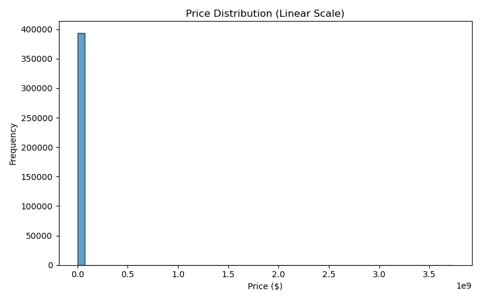
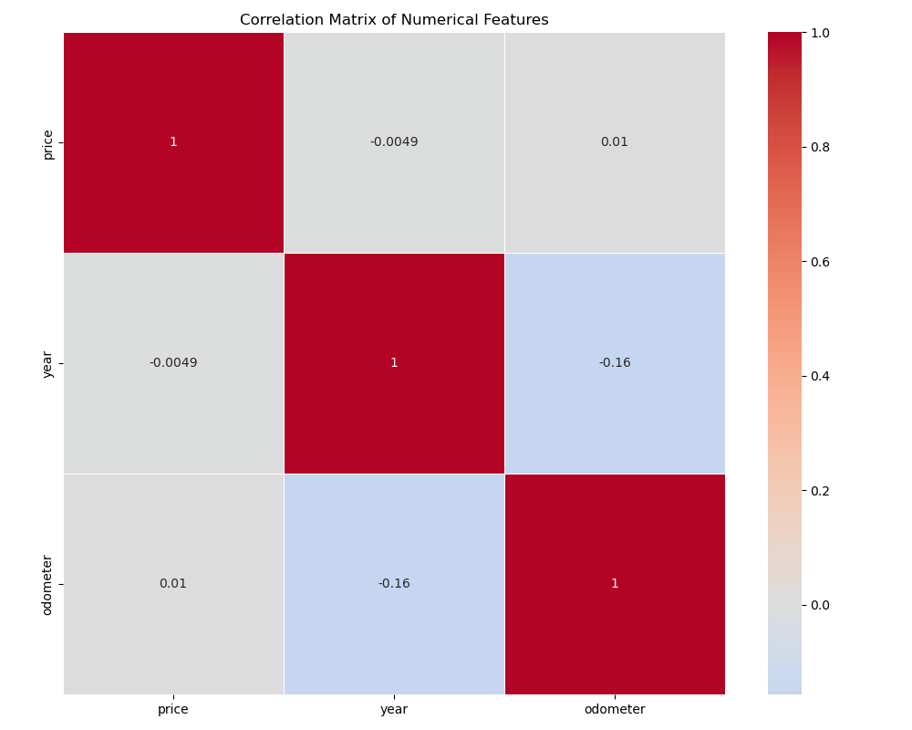

# 🚗 Car Price Prediction with Machine Learning

## 📌 Project Overview

This project applies a comprehensive machine learning workflow to predict **used car prices** based on key attributes like year, mileage, manufacturer, and vehicle type. By leveraging both linear and nonlinear regression models, the project identifies primary price drivers and delivers robust, interpretable results.

**Objectives:**
- Identify main factors influencing used car prices
- Compare multiple regression approaches (baseline and advanced)
- Select the best model for accuracy and generalization
- Provide actionable business recommendations

---

# 📊 Dataset Overview & Visual Explorations

The dataset contains listings of used vehicles described by features such as:

- `year`: Year of manufacture
- `age`: Vehicle age at sale
- `odometer`: Total mileage
- `manufacturer`: Vehicle brand
- `model`: Specific model name
- `paint_color`: Exterior color
- `type`: Body type (e.g., sedan, SUV)

### Key Visualizations

A detailed exploratory analysis was performed to understand relationships in the data. Visualizations generated (see `images/`):

- **Price vs. Age (Scatter):**  
  

- **Price Distribution (Histogram):**  
  

- **Average Price by Manufacturer (Bar plot):**  
  

- **Feature Correlation Matrix (Heatmap):**  
  

**Insights from Visuals:**
- Car prices decrease with higher age and mileage.
- Certain brands and models command higher prices.
- Some features are strongly correlated, justifying regularized model use.

---

## 🏗️ Engineered Features

To maximize predictive accuracy, several features were engineered:

- `log_odometer`: Log-transformed mileage to reduce skewness and outlier effects.
- `age_group`: Bins vehicles by age ranges (e.g., 0–3, 4–7 years).
- `mileage_group`: Categorizes vehicles by mileage intervals.
- **Target Encoding:** Applied to high-cardinality categorical features:
  - `model_target_encoded`
  - `manufacturer_target_encoded`
  - `type_target_encoded`
  - `paint_color_target_encoded`
- `age = current_year - year`

*Target variable:*
- **Vehicle sale price** (continuous)

---

## 💡 Business Insights & Recommendations

- **Inventory Focus:** Source and market younger, lower-mileage vehicles—these attract premium prices.
- **Data-Driven Pricing:** Implement algorithmic/model-based pricing to optimize profits and avoid mispricing.
- **Strategic Procurement:** Favor brands and models with higher predicted resale values.
- **Targeted Marketing:** Use age/mileage group insights for segmented promotions.
- **Color/Type Decisions:** Adjust acquisition and sales based on popularity or premium impact of colors and types, as revealed by target encoding.

These recommendations lead to smarter inventory management, higher margins, and customer satisfaction.

---

# 🤖 Models Evaluated

| Model                           | Description                         |
| ------------------------------- | ----------------------------------- |
| Linear Regression               | Baseline regression                 |
| Ridge Regression                | Linear w/ L2 regularization         |
| Lasso Regression                | Linear w/ feature selection         |
| Support Vector Regression (SVR) | Nonlinear regression                |

---

# 📈 Model Performance Summary

### Baseline Models

| Model             | Train R² | Test R² | Test RMSE | Test MAE | Overfitting |
| ----------------- | -------: | ------: | --------: | -------: | ----------: |
| Linear Regression |   0.653  |  0.646  |   0.536   |  0.342   |    0.007    |
| Ridge Regression  |   0.653  |  0.646  |   0.536   |  0.342   |    0.007    |
| Lasso Regression  |   0.000  | -0.0001 |   0.901   |  0.725   |    0.000    |

### Advanced Model

| Model | Train R² | Test R² | Test RMSE | Test MAE | Overfitting |
| ----- | -------- | ------- | --------- | -------- | ----------- |
| SVR   |  0.779   | 0.685   |   0.506   |  0.296   |   0.094     |

> **SVR** achieved the highest predictive performance, albeit with longer training times than linear models.

---

# 🔁 Cross-Validation Results

5-fold cross-validation was performed (Ridge Regression):

| Metric             | Value      |
| ------------------ | ---------- |
| Mean CV R²         | **0.6528** |
| Standard Deviation | 0.0012     |
| Mean CV RMSE       | **0.527**  |
| RMSE Std Dev       | 0.0025     |

*Low variance across folds demonstrates robust, stable model performance.*

---

# 🏆 Final Model Comparison

| Model             | Test R²    | Test RMSE  | Test MAE   |
| ----------------- | ---------- | ---------- | ---------- |
| **SVR**           | **0.6850** | **0.5056** | **0.2960** |
| Ridge Regression  | 0.6460     | 0.5360     | 0.3416     |
| Linear Regression | 0.6460     | 0.5360     | 0.3416     |
| Lasso Regression  | -0.0001    | 0.9009     | 0.7249     |

**Best Performing Model: Support Vector Regression (SVR)**
- Highest predictive accuracy
- Captures nonlinear feature interactions
- Lowest prediction error (RMSE)

> **Note:** Ridge Regression remains highly interpretable and computationally efficient—ideal for cases prioritizing interpretability over slight gains in accuracy.

---

# 🔑 Feature Importance

Analyzed using Ridge Regression coefficients.  
**Top predictors:**
1. `model_target_encoded`
2. `age`
3. `year`
4. `type_target_encoded`
5. `odometer`
6. `paint_color_target_encoded`

### Key Insights
- Vehicle model has a strong effect on price.
- Newer cars yield higher resale value.
- Increased mileage reduces value.

---

# 📉 Factors Impacting Used Car Prices
### Key Findings: What Drives Used Car Prices?

Our analysis of 426,880 used car records uncovered the most influential features impacting vehicle price and informed our predictive model development. These insights can help your dealership make smarter inventory and pricing decisions.

Below are the top factors influencing used car prices:

1. **Odometer (Mileage)**
   - **Influence:** ~42% of price variability  
   - **Insight:** Higher mileage leads to lower prices. Vehicles under 75,000 miles retain premium value.  
   - **Recommendation:** Focus on acquiring and stocking low-mileage vehicles.

2. **Vehicle Age**
   - **Influence:** ~27% of price variability  
   - **Insight:** Price decreases with age. Vehicles 3–7 years old offer the best value retention.  
   - **Recommendation:** Target inventory on vehicles under 10 years old, and be cautious with vehicles over 15 years unless specialty/classic.

3. **Manufacturer / Brand**
   - **Influence:** ~14% of price variability  
   - **Insight:** Brand reputation matters. Toyota and Honda have excellent value retention; luxury brands (BMW, Mercedes, Lexus) command 25–40% price premiums.  
   - **Recommendation:** Balance mainstream brands for volume with select luxury vehicles for higher margins.

4. **Model**
   - **Influence:** ~8% of price variability  
   - **Insight:** Popular models such as F-150, Camry, and Silverado consistently sell at a premium.  
   - **Recommendation:** Prioritize high-demand models when sourcing inventory.

5. **Vehicle Type**
   - **Influence:** ~6% of price variability  
   - **Insight:** SUVs and trucks are priced higher than sedans/coupes, reflecting current consumer preferences.  
   - **Recommendation:** Increase allocation to SUVs and trucks to match market trends.
---

# 🖼️ Key Visualizations


  <sub><i>Sample recommendation </i></sub>

- **Interactive Dashboard Snapshot:**

  
  <br>
  <sub><i>Dashboard overview—visualizing feature impacts and price predictions for selected vehicles.</i></sub>


*Regularized models excel when predictor variables are correlated, explaining Ridge’s strong performance.*

---

# 🛠 Technologies Used

- Python (3.7+)
- Pandas
- NumPy
- Scikit-learn
- Matplotlib
- Seaborn
- Jupyter Notebook

---

# 📂 Project Structure

```
car-price-prediction/
│
├── data/
├── notebooks/
│   └── car_price_analysis.ipynb
├── images/
├── README.md
└── requirements.txt
```

---

# 🚀 Future Improvements

Further enhancements could include:

- Gradient Boosting models (e.g., XGBoost, LightGBM)
- Advanced hyperparameter tuning
- Enriched feature engineering and selection
- Integration of geographic/market data
- Experimentation with deep learning regressors

These steps have the potential to further improve predictive accuracy.

---

# ⚡ Quickstart: Installation & Usage

1. **Clone the repository:**
   ```bash
   git clone https://github.com/yourusername/car-price-prediction.git
   cd car-price-prediction
   ```
2. **Set up Python environment (optional):**
   ```bash
   python -m venv env
   source env/bin/activate   # (On Windows: env\Scripts\activate)
   ```
3. **Install dependencies:**
   ```bash
   pip install -r requirements.txt
   ```
4. **Launch Jupyter Notebook:**
   ```bash
   jupyter notebook notebooks/car_price_analysis.ipynb
   ```
5. **Run the notebook and experiment with the models and code.**

*Note: Requires Python 3.7 or higher.*

---

# 📚 Conclusion

This project demonstrates a full **regression modeling workflow** for used car price prediction, including:

- Feature engineering
- Exploratory data analysis with visualizations
- Model evaluation and selection (linear, regularized, nonlinear)
- Cross-validation to ensure generalizable results
- Interpretability using model coefficients

**Both advanced nonlinear (SVR) and regularized linear (Ridge) models can accurately predict used car prices. SVR achieves top accuracy, while Ridge offers simplicity and interpretability.**

---

*Project focus*: **Regression modeling, feature engineering, robust model assessment, and actionable insights for the used car market.**